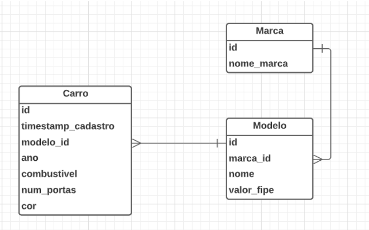

This project is for test assignment for a mid-senior backend developer position.

The project consists of creating a backend application with 3 entities, Carro, Modelo and Marca (names in Portuguese because it is written like that in the modeling).



For the carros query route, it must return a custom json in this format (fully copied, maybe I change somethings... but same pattern!):

```json
{
    "carros": [
        {
            "id": 1,
            "timestamp_cadastro": 1696539488,
            "modelo_id": 12,
            "ano": 2015,
            "combustivel": "FLEX",
            "num_portas": 4
            "cor": "BEGE",
            "nome_modelo": "ONIX PLUS",
            "valor": 50.000
        },
        {
            "id": 2,
            "timestamp_cadastro": 1696531234,
            "modelo_id": 14,
            "ano": 2014,
            "combustivel": "FLEX",
            "num_portas": 4
            "cor": "AZUL",
            "nome_modelo": "JETTA",
            "valor": 49.000
        },
        {
            "id": 3,
            "timestamp_cadastro": 16965354321,
            "modelo_id": 79,
            "ano": 1993,
            "combustivel": "DIESEL",
            "num_portas": 4
            "cor": "AZUL",
            "nome_modelo": "HILLUX SW4",
            "valor": 47.500
        }
    ]
}
``````

In the other routes, as nothing was specified, I implemented it in the way I thought most appropriate.

In total, the application has 15 routes (5 for each entity)

```api
GET hostname:port/api/carros/
GET hostname:port/api/carros/:id
POST hostname:port/api/carros/
PUT hostname:port/api/carros/:id
DELETE hostname:port/api/carros/:id

GET hostname:port/api/modelos/
GET hostname:port/api/models/:id
POST hostname:port/api/modelos/
PUT hostname:port/api/modelos/:id
DELETE hostname:port/api/modelos/:id

GET hostname:port/api/marcas/
GET hostname:port/api/marcas/:id
POST hostname:port/api/marcas/
PUT hostname:port/api/marcas/:id
DELETE hostname:port/api/marcas/:id
```


The routes are made to carry out CRUD operations, in common we have:

1. Route to access all entity records
2. Route to access a specific record
3. Route to create a new record
4. Route to change an existing record
5. Route to delete an existing record

Things to note:

* Errors are handled by [Controller Advice](./java-version/src/main/java/com/ur4n0/avaliacaobackendjava/core/handlers/RestExceptionHandler.java)

* There are a [pre-insered registers](./java-version/src/main/resources/sql/) ( just to demonstrate )

* This use H2database, so it's saved in memory

# Expected JSON OBJECTS

### When send to carros 
Routes:

1. POST hostname:port/api/carros/
2. PUT hostname:port/api/carros/:id

```json
{
  "modelo_id": INTEGER,
  "ano": INTEGER,
  "combustivel": STRING,
  "cor": STRING,
  "num_portas": INTEGER
}
```

### When send to modelos

Routes:

1. POST hostname:port/api/modelos/
2. PUT hostname:port/api/modelos/:id

```json
{
  "nome": STRING,
  "valor_fipe": INTEGER,
  "marca_id": INTEGER
}
```

### When send to marcas

Routes:

1. POST hostname:port/api/marcas/
2. PUT hostname:port/api/marcas/:id

```json
{
  "nome_marca": STRING
}
```

# ROUTES ERRORS

The errors that the backend currently handles are:

## Create

1. POST hostname:port/api/carros/
2. POST hostname:port/api/modelos/
3. POST hostname:port/api/marcas/

* Return 400 When: Client inserts a json that is invalid, informs that that object is invalid and cannot be created.

## Read

#### All

There are 3 routes:

1. GET hostname:port/api/carros/
2. GET hostname:port/api/modelos/
3. GET hostname:port/api/marcas/

In these 3 routes, no error is returned, if there is no record in the database, a 200 is returned with an empty object.


#### By id

1. GET hostname:port/api/carros/:id
2. GET hostname:port/api/models/:id
3. GET hostname:port/api/marcas/:id

* Return 404 When: A record with this id does not exist.

## Update

1. PUT hostname:port/api/carros/:id
2. PUT hostname:port/api/modelos/:id
3. PUT hostname:port/api/marcas/:id

* Return 404 When: A record with this id does not exist.
* Return 400 when: Client inserts a json that is invalid, informs that that object is invalid!

## Delete

1. DELETE hostname:port/api/carros/:id
2. DELETE hostname:port/api/modelos/:id
3. DELETE hostname:port/api/marcas/:id

* Return 404 When: A record with this id does not exist.
